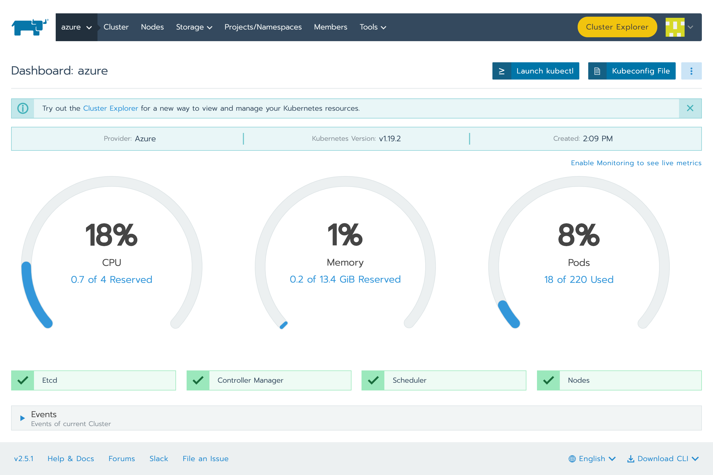
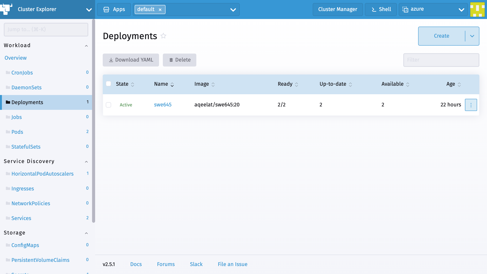
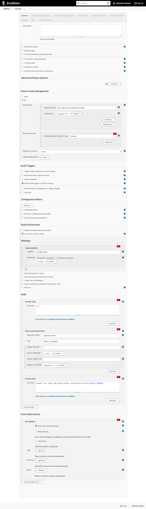
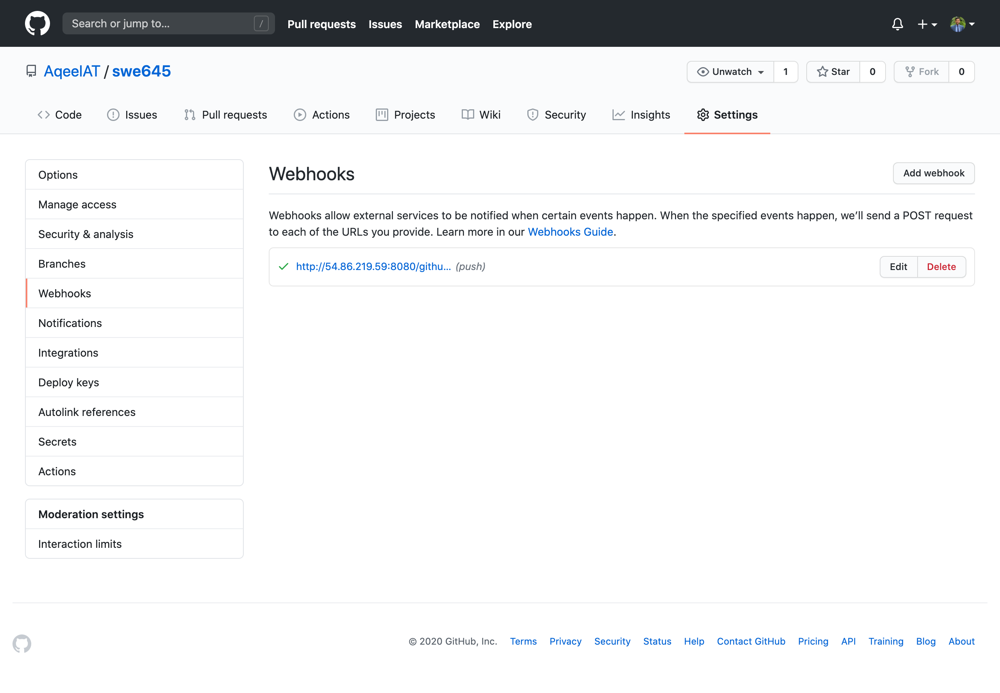
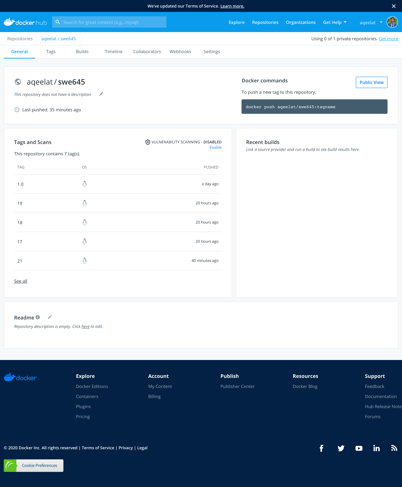

Abdullah Alaqeel  
G00915482

Website:
* http://swe645-aalaqeel.s3-website-us-east-1.amazonaws.com/  

Server:
* Rancher: https://54.86.219.59
* Jenkins: http://54.86.219.59:8080  

Agnets (load balanced)  
* http://138.91.190.41
* Survey: http://138.91.190.41/survey

Video:  
* https://youtu.be/Yv2tfsFx_AI  

Docker Repo:
* https://hub.docker.com/repository/docker/aqeelat/swe645

---

## Server:

I created a t2.medium EC2 instance and:
* installed docker
* installed jenkins
* ran rancher as a docker container  
Steps to reproduce are in [this script](server.sh).

## Agents:
After much trial and error, I decided to go with setting up RKE on Azure virtual machines. My deployment contains 2 virtual machines deployed automatically by Rancher.   
I used this [tutorual](https://docs.microsoft.com/en-gb/azure/active-directory/develop/howto-create-service-principal-portal) to do the steps necessary to link Rancher with Azure.  

## Jenkins
I created a multi-step jenkins pipeline and used multiple plugins to achieve the desired goal. The steps I went through are similar to the reference document.

However, to deploy the updates to kubernates, I run a kubectl script to update the image in the kubernates deployment, which is then rolled out to all the pods.

The Ant build can be found here: [build.xml](build.xml)

## Github
Webhook added!

## Docker
I created a public repository to manage the updated docker image.
The dockerfile is here: [Dockerfile](Dockerfile)
